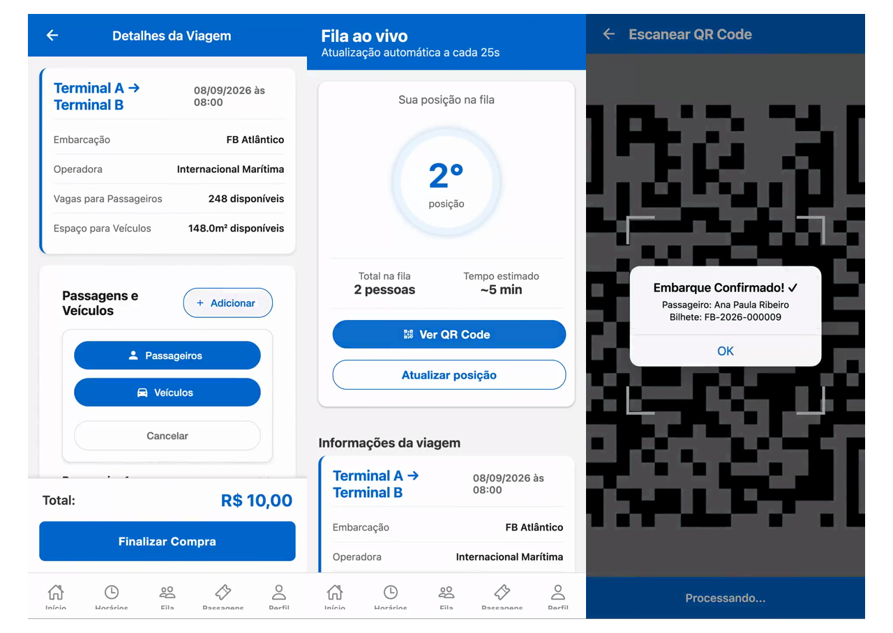

# Ferry Boat SLZ

**Mobile MVP for a ferry line: ticket and vehicle booking, a digital queue with your position, and boarding checked by QR code.**

[Em português](README.pt-BR.md) · [All nine modules on video](https://www.gustacg.com/en/projects/ferry-boat-slz)


<p align="center">
  
</p>

## The problem

A ferry's capacity is not a single count. A pedestrian takes a seat, a vehicle takes deck area, and checking people aboard needs a ticket that cannot be duplicated. Ferries in São Luís board by paper and by shouting names; this MVP puts the ticket, the queue and the boarding check on the phone.

## What it does

**Passenger**

- Browse departures for the next five days, with free seats and a "few left" warning.
- Book pedestrians and vehicles in one purchase: the app validates name, CPF, plate and model, lets you say which passenger drives which vehicle, and checks free seats and free deck area before closing.
- Get one QR code per ticket, or one screen with the whole group.
- Join the digital queue for a trip and see your position, how many are ahead and the estimated wait. The screen refreshes every 25 seconds.
- Cancel a ticket, or the whole booking, up to a minimum window before departure. The seat goes back automatically.
- Profile with trip history and total spent, notifications, FAQ with support contacts.

**Boarding operator**

- Today's trips, each with its queue size.
- Boarding control: start boarding, mark departure, cancel a trip with a reason.
- Scanner: the camera reads the QR code, the database validates it (unknown code, cancelled ticket, ticket already used) and the app confirms the ticket belongs to that trip before marking the passenger aboard.

## Design decisions

- **Capacity on three axes.** Pedestrians, vehicles and deck area in square metres. The purchase screen blocks when any of the three runs out.
- **Fares live in a table.** Category, price and area come from the database at every screen load, so a price change does not need a new app release. Queue priority is by category: elderly and disabled first, then children, students and adults. The seed ships two categories, adult and student; add the others as rows.
- **The database owns the invariants.** Ticket numbering, the QR code hash and the seat recount are triggers. Cancelling a ticket returns the seat without the app doing any arithmetic.
- **Roles.** `usuario`, `operador` and `admin`. Operators and admins land on the boarding panel; there is no dedicated admin screen yet.

## Stack

React Native 0.81 · Expo SDK 54 with expo-router · TypeScript · Zustand · React Native Paper · expo-camera · PostgreSQL 17 (auth, RPCs and triggers via Supabase)

## Running it from zero

Requirements: Node 18+, the [Supabase CLI](https://supabase.com/docs/guides/local-development), Docker (for the local database) and Expo Go on your phone.

```bash
git clone https://github.com/gustacg/ferry_boat_slz.git
cd ferry_boat_slz
npm install
cp .env.example .env
```

Fill the two variables in `.env` with the values the next step prints:

```
EXPO_PUBLIC_SUPABASE_URL=
EXPO_PUBLIC_SUPABASE_ANON_KEY=
```

Start the local database and apply the migrations. Migration `003` is the seed: routes, three vessels, three timetables, trips for the next 30 days and the fares.

```bash
supabase start
supabase db reset
```

Create the operator: add a user in the local Auth panel (Studio runs on port 54423), put that user's e-mail in `supabase/migrations/005_operator.sql`, and run the file. It links the profile and the `operador` role by e-mail, so the user has to exist first.

Run the app:

```bash
npx expo start
```

Scan the QR code with Expo Go. Phone and computer must be on the same network. The boarding scanner needs a real camera.

To point the app at a hosted project instead, `supabase link` then `supabase db push`, and put that project's URL and anon key in `.env`.

## Project layout

```
app/          screens: (tabs)/ for passengers, operator/ for boarding, login and signup
components/   Button, TicketCard, TripCard, QueueIndicator, LoadingSpinner
services/     supabase client, boardingService, queueService
stores/       auth, trips, tickets, queue, notifications (Zustand)
supabase/     config.toml and migrations 000 to 007
types/        shared types
utils/        dates (São Paulo time zone) and validators (CPF, plate)
```

About 10,000 lines of TypeScript and 550 lines of SQL.

## Status

MVP. Presented to innovation representatives of Porto do Itaqui. Not in commercial operation.

## License

MIT, see [LICENSE](LICENSE).

## Author

Gustavo Calixto · [gustacg.com](https://www.gustacg.com) · [LinkedIn](https://www.linkedin.com/in/gustacg/)
